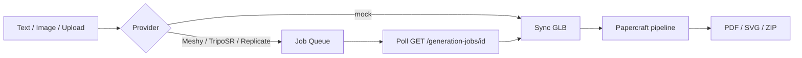

# FoldForge AI Generation

## Overview

FoldForge supports text-to-3D and image-to-3D before the papercraft pipeline.
Production providers run through an async job queue and the Studio frontend polls
for progress.



## Providers

| Provider | Config | Text | Image | Async |
|----------|--------|------|-------|-------|
| `auto` | picks best available | yes | yes | when production |
| `mock` | none | yes | yes | optional |
| `meshy` | `MESHY_API_KEY` | yes | yes | yes |
| `triposr` | `REPLICATE_API_TOKEN` + `TRIPOSR_REPLICATE_VERSION` | no | yes | yes |
| `replicate` | `REPLICATE_API_TOKEN` + model versions | yes | yes | yes |

Copy `apps/api/.env.example` to `apps/api/.env` and set the provider keys:

```env
AI_PROVIDER=auto
AI_ALLOW_PROVIDER_FALLBACK=false
MESHY_API_KEY=
REPLICATE_API_TOKEN=
REPLICATE_TEXT_MODEL=
REPLICATE_IMAGE_MODEL=
TRIPOSR_REPLICATE_VERSION=
```

`auto` selection order:

1. Meshy, if `MESHY_API_KEY` is set.
2. TripoSR, if `REPLICATE_API_TOKEN` and `TRIPOSR_REPLICATE_VERSION` are set.
3. Replicate, if token and at least one model version are set.
4. Mock, as an offline procedural fallback.

Production provider failures are visible by default. Set
`AI_ALLOW_PROVIDER_FALLBACK=true` only when you intentionally want Replicate
failures to fall back to the offline mock provider during demos.

## Async Generation Queue

Production providers return `202 Accepted` with a `jobId`. Poll until `status`
is `completed` or `failed`.

```http
POST /api/generate-from-text
-> 202 { projectId, jobId, async: true, status: "processing" }

GET /api/generation-jobs/{jobId}
-> { status, progress, message, sourceFileUrl? }
```

Job statuses: `queued` -> `running` -> `completed` | `failed`.

The worker starts automatically via FastAPI lifespan (`generation_queue.py`).

## API Endpoints

### List providers

```http
GET /api/ai/providers
```

Returns active backend status plus provider-specific capability flags:

```json
[
  {
    "name": "meshy",
    "active": true,
    "available": true,
    "configured": true,
    "text": true,
    "image": true,
    "reason": "",
    "async": true
  }
]
```

### Text to 3D

```http
POST /api/generate-from-text
Content-Type: application/json

{
  "prompt": "A low poly cat for papercraft",
  "style": "low_poly",
  "name": "My Cat"
}
```

### Image to 3D

```http
POST /api/generate-from-image
Content-Type: multipart/form-data

file: image
style: low_poly | cute | geometric
hint: optional text hint
name: optional project name
```

Both return a `projectId` and eventually `sourceFileUrl` (GLB), then call
`POST /api/process-model`.

## Meshy Integration

Meshy uses papercraft-friendly settings:

- Text: `POST /openapi/v2/text-to-3d` with preview/low-poly options.
- Image: `POST /openapi/v1/image-to-3d` with textures disabled and GLB output.

Images are sent as base64 data URIs from local storage.

## TripoSR Integration

TripoSR runs via Replicate using `TRIPOSR_REPLICATE_VERSION`. It is image-only;
use Meshy or a configured Replicate text model for text-to-3D.

## Architecture

```text
app/services/ai/
  base.py              # ModelGeneratorProvider interface
  generation_queue.py  # Background worker
  job_store.py         # SQLite-backed job store
  http_utils.py        # Download + data URI helpers
  registry.py          # auto | meshy | triposr | replicate | mock
  providers/
    mock.py
    meshy.py
    triposr.py
    replicate.py
```

## Frontend

`apps/web/lib/generation-job.ts` exposes `pollGenerationJob(jobId)`. The Text
and Image panels also call `/api/ai/providers` to show whether the app is using
a real AI backend or offline mock generation.
