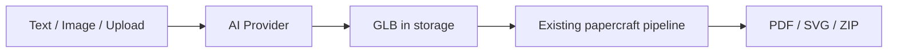

# FoldForge AI Generation (Phase 2)

## Overview

Phase 2 adds **Text-to-3D** and **Image-to-3D** inputs before the existing papercraft pipeline.



## Providers

| Provider | Config | Behavior |
|----------|--------|----------|
| `mock` (default) | none | Offline procedural text meshes + image heightmap relief |
| `replicate` | `REPLICATE_API_TOKEN` | Calls Replicate API; falls back to mock on failure |

Set in `apps/api/.env`:

```env
AI_PROVIDER=mock
REPLICATE_API_TOKEN=
REPLICATE_TEXT_MODEL=
REPLICATE_IMAGE_MODEL=
```

## API Endpoints

### List providers

```http
GET /api/ai/providers
```

### Text to 3D

```http
POST /api/generate-from-text
Content-Type: application/json

{
  "prompt": "A low poly cat for papercraft",
  "style": "low_poly",
  "name": "My Cat"
}
```

### Image to 3D

```http
POST /api/generate-from-image
Content-Type: multipart/form-data

file: image
style: low_poly | cute | geometric
hint: optional text hint
name: optional project name
```

Both return a `projectId` and `sourceFileUrl` (GLB), same as upload — then call `POST /api/process-model`.

## Prompt Enhancement

All prompts are wrapped with papercraft-specific guidance via `prompt_builder.py`:

- Low Poly → faceted, printable faces
- Cute → rounded, chibi proportions
- Geometric → angular sculpture forms

## Architecture

```
app/services/ai/
  base.py              # ModelGeneratorProvider interface
  prompt_builder.py    # Style-aware prompts
  procedural.py        # Offline text → mesh heuristics
  heightmap.py         # Offline image → relief mesh
  registry.py          # Provider selection
  providers/
    mock.py            # Default offline provider
    replicate.py       # Optional cloud provider
```

Replace or extend providers without changing the API contract.

## Upgrading to Real AI

1. Obtain a [Replicate](https://replicate.com) API token
2. Set model version IDs for text/image models (e.g. TripoSR for images)
3. Set `AI_PROVIDER=replicate`
4. Restart the API

The mock provider remains the fallback for development and when tokens are absent.
