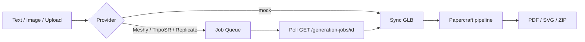

# FoldForge AI Generation (Phase 2+)

## Overview

Phase 2 adds **Text-to-3D** and **Image-to-3D** inputs before the existing papercraft pipeline. Production providers run in an **async job queue** with frontend polling.



## Providers

| Provider | Config | Text | Image | Async |
|----------|--------|------|-------|-------|
| `auto` (default) | picks best available | ✓ | ✓ | when production |
| `mock` | none | ✓ | ✓ | optional |
| `meshy` | `MESHY_API_KEY` | ✓ | ✓ | ✓ |
| `triposr` | `REPLICATE_API_TOKEN` + `TRIPOSR_REPLICATE_VERSION` | procedural fallback | ✓ | ✓ |
| `replicate` | `REPLICATE_API_TOKEN` | ✓ | ✓ | ✓ |

Set in `apps/api/.env`:

```env
AI_PROVIDER=auto
MESHY_API_KEY=
REPLICATE_API_TOKEN=
TRIPOSR_REPLICATE_VERSION=
```

### Auto selection order

1. **Meshy** — if `MESHY_API_KEY` is set (text + image, low-poly preview mode)
2. **TripoSR** — if Replicate token + TripoSR version (image; text uses procedural fallback)
3. **Replicate** — if token set (generic models)
4. **Mock** — offline procedural / heightmap

## Async generation queue

Production providers return **HTTP 202** with a `jobId`. Poll until `status` is `completed` or `failed`.

```http
POST /api/generate-from-text
→ 202 { projectId, jobId, async: true, status: "processing" }

GET /api/generation-jobs/{jobId}
→ { status, progress, message, sourceFileUrl? }
```

Job statuses: `queued` → `running` → `completed` | `failed`

The worker starts automatically via FastAPI lifespan (`generation_queue.py`).

## API Endpoints

### List providers

```http
GET /api/ai/providers
```

### Poll generation job

```http
GET /api/generation-jobs/{jobId}
```

### Text to 3D

```http
POST /api/generate-from-text
Content-Type: application/json

{
  "prompt": "A low poly cat for papercraft",
  "style": "low_poly",
  "name": "My Cat"
}
```

### Image to 3D

```http
POST /api/generate-from-image
Content-Type: multipart/form-data

file: image
style: low_poly | cute | geometric
hint: optional text hint
name: optional project name
```

Both return a `projectId` and eventually `sourceFileUrl` (GLB) — then call `POST /api/process-model`.

## Meshy integration

Uses Meshy REST API with papercraft-friendly settings:

- **Text:** `POST /openapi/v2/text-to-3d` with `mode: preview`, `model_type: lowpoly`
- **Image:** `POST /openapi/v1/image-to-3d` with `should_texture: false`, `target_formats: ["glb"]`

Images are sent as base64 data URIs from local storage.

## TripoSR integration

TripoSR runs via [Replicate](https://replicate.com) using `TRIPOSR_REPLICATE_VERSION` (model version hash). Install optional dependency:

```bash
pip install replicate
```

## Architecture

```
app/services/ai/
  base.py              # ModelGeneratorProvider interface
  generation_queue.py  # Background worker
  job_store.py         # In-memory job store
  http_utils.py        # Download + data URI helpers
  registry.py          # auto | meshy | triposr | replicate | mock
  providers/
    mock.py
    meshy.py
    triposr.py
    replicate.py
```

## Frontend polling

`apps/web/lib/generation-job.ts` exposes `pollGenerationJob(jobId)` used by Text/Image panels with progress UI.
